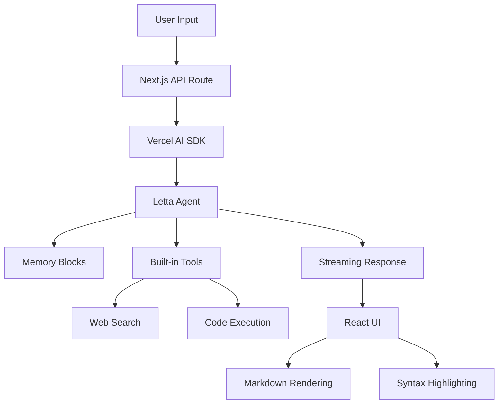

# Letta Chat Assistant

A modern, professional Next.js chat application powered by [Letta](https://docs.letta.com/), featuring stateful AI agents with persistent memory and an advanced Claude-style interface.

  

## ✨ Features

### 🧠 **Stateful AI Capabilities**
- **Persistent Memory**: Agent remembers conversations across sessions
- **Learning & Adaptation**: Improves responses based on interaction history
- **Built-in Tools**: Web search and code execution capabilities
- **Memory Blocks**: Custom persona, human context, and project awareness

### 🎨 **Modern User Interface**
- **Claude-Style Layout**: Professional sidebar with chat history
- **Real-time Streaming**: Live response streaming with typing indicators
- **Markdown & Code Support**: Full syntax highlighting for 100+ languages
- **Dark Mode**: Automatic theme switching with system preferences
- **Responsive Design**: Works perfectly on desktop, tablet, and mobile

### 🚀 **Advanced Chat Features**
- **New Chat Sessions**: Start fresh conversations with one click
- **Message Actions**: Copy any message (user or assistant) with hover controls
- **Auto-scroll**: Smooth scrolling to new messages
- **Error Handling**: Graceful error display and recovery
- **Suggestion Buttons**: Quick-start prompts for new conversations

### 🎯 **Developer Experience**
- **TypeScript**: Full type safety throughout the application
- **shadcn/ui**: Beautiful, accessible UI components
- **Tailwind CSS**: Utility-first styling with custom design system
- **Hot Reload**: Instant development feedback
- **Clean Architecture**: Well-organized component structure

## 🚀 Quick Start

### Prerequisites

- **Node.js 18+** installed
- **Letta Cloud Account** - Get one free at [app.letta.com](https://app.letta.com)

### 1. Clone & Install

```bash
git clone https://github.com/jyotirmi/letta-chatbot-iqagent.git
cd letta-chatbot-iqagent
npm install
```

### 2. Get Your Letta API Key

1. Sign up at [https://app.letta.com](https://app.letta.com)
2. Navigate to [API Keys](https://app.letta.com/api-keys)
3. Create a new API key and copy it

### 3. Configure Environment

```bash
# Copy environment template
cp env.example .env.local

# Edit .env.local and add your API key:
# LETTA_API_KEY=your_api_key_here
```

### 4. Create Your Agent

```bash
# This creates a new Letta agent with custom memory blocks
npm run setup-agent
```

The setup script will:
- Create an agent named "Alex" 
- Configure memory blocks (persona, human, project context)
- Enable built-in tools (web_search, run_code)
- Save the agent ID to your environment

### 5. Start the Application

```bash
npm run dev
```

Open [http://localhost:3000](http://localhost:3000) and start chatting! 🎉

## 🏗️ Project Structure

```
├── app/                          # Next.js App Router
│   ├── api/chat/route.ts        # Streaming chat API endpoint
│   ├── globals.css              # Global styles & CSS variables
│   ├── layout.tsx               # Root layout with metadata
│   └── page.tsx                 # Main application page
├── components/
│   └── ui/                      # UI Components
│       ├── main-chat.tsx        # Main chat interface with input
│       ├── enhanced-chat.tsx    # Message list with auto-scroll
│       ├── sidebar.tsx          # Navigation sidebar
│       ├── message.tsx          # Individual message component
│       ├── suggestion-buttons.tsx # Quick-start prompts
│       ├── button.tsx           # Reusable button component
│       ├── textarea.tsx         # Auto-resizing text input
│       ├── avatar.tsx           # User/AI avatars
│       └── scroll-area.tsx      # Custom scroll container
├── lib/
│   └── utils.ts                 # Utility functions (cn helper)
├── scripts/
│   └── setup-agent.ts           # Agent creation & configuration
└── env.example                  # Environment variables template
```

## 🔧 Key Technologies

| Technology | Purpose | Version |
|------------|---------|---------|
| **[Letta](https://docs.letta.com/)** | Stateful AI agent platform | Latest |
| **[Next.js](https://nextjs.org/)** | React framework with App Router | 15.x |
| **[Vercel AI SDK](https://sdk.vercel.ai/)** | Streaming AI responses | 4.x |
| **[shadcn/ui](https://ui.shadcn.com/)** | Beautiful UI components | Latest |
| **[Tailwind CSS](https://tailwindcss.com/)** | Utility-first CSS framework | 3.x |
| **[React Markdown](https://github.com/remarkjs/react-markdown)** | Markdown rendering | 10.x |
| **[Syntax Highlighter](https://github.com/react-syntax-highlighter/react-syntax-highlighter)** | Code syntax highlighting | 15.x |
| **[Lucide React](https://lucide.dev/)** | Beautiful icons | Latest |

## 💡 How It Works

### Architecture Overview



### Stateful vs Stateless

| Feature | Traditional Chatbots | Letta Agents |
|---------|---------------------|--------------|
| **Memory** | No persistent memory | Full conversation history |
| **Context** | Limited to current session | Cross-session context retention |
| **Learning** | Static responses | Adaptive, learning responses |
| **Tools** | Limited or no tools | Built-in web search & code execution |
| **Personalization** | Generic responses | Personalized based on user history |

### Message Flow

1. **User Input** → Captured in textarea with auto-resize
2. **API Processing** → Next.js route validates and forwards to Letta
3. **Agent Processing** → Letta agent accesses full conversation history
4. **Tool Execution** → Agent can search web or execute code if needed
5. **Response Generation** → Streaming response with markdown support
6. **UI Rendering** → Real-time updates with syntax highlighting

## 🎨 UI Components

### Chat Interface
- **Sidebar**: Navigation with chat history and new chat button
- **Main Chat**: Message list with auto-scroll and typing indicators
- **Input Area**: Auto-resizing textarea with send button and attachment placeholder
- **Message Bubbles**: Distinct styling for user (gray) and assistant (white) messages

### Message Features
- **Markdown Support**: Headers, lists, links, tables, blockquotes
- **Code Highlighting**: 100+ programming languages with VS Code Dark+ theme
- **Copy Functionality**: One-click copy for any message
- **Action Buttons**: Copy, like, dislike for assistant messages
- **Timestamps**: Formatted time display

### Responsive Design
- **Desktop**: Full sidebar with spacious chat area
- **Tablet**: Collapsible sidebar with touch-friendly controls
- **Mobile**: Stack layout with optimized input handling

## 🛠️ Customization

### Modify Agent Personality

Edit `scripts/setup-agent.ts`:

```typescript
const persona = {
  name: "persona",
  value: "Your custom personality here...",
  description: "The agent's core personality and behavior"
}
```

### Add Custom Tools

```typescript
// Enable additional tools during agent creation
const tools = ["web_search", "run_code", "your_custom_tool"]
```

### Customize UI Theme

Edit `app/globals.css` CSS variables:

```css
:root {
  --background: 0 0% 100%;
  --foreground: 224 71.4% 4.1%;
  /* Customize colors here */
}
```

### Modify Suggestion Buttons

Edit `components/ui/suggestion-buttons.tsx`:

```typescript
const suggestions = [
  "Your custom suggestion 1",
  "Your custom suggestion 2",
  // Add more suggestions
]
```

## 📖 Advanced Usage

### Multiple Agents

Create different agents for different purposes:

```bash
# Create a coding assistant
LETTA_AGENT_TYPE=coding npm run setup-agent

# Create a research assistant  
LETTA_AGENT_TYPE=research npm run setup-agent
```

### Custom Memory Blocks

Add domain-specific memory:

```typescript
const customMemory = {
  name: "project_knowledge",
  value: "Information about your specific project...",
  description: "Domain-specific context and knowledge"
}
```

### Integration with External APIs

Extend the chat API to integrate with other services:

```typescript
// app/api/chat/route.ts
export async function POST(req: Request) {
  // Add custom preprocessing
  // Integrate with external APIs
  // Custom response formatting
}
```

## 🐛 Troubleshooting

### Common Issues

| Problem | Solution |
|---------|----------|
| **Agent not responding** | Check API key in `.env.local` |
| **Styling issues** | Clear `.next` cache and restart |
| **Build errors** | Update dependencies: `npm update` |
| **Memory errors** | Restart development server |

### Debug Mode

Enable detailed logging:

```bash
DEBUG=letta* npm run dev
```

### Reset Agent

If your agent becomes unresponsive:

```bash
# Create a fresh agent
rm .env.local
cp env.example .env.local
# Add your API key and run setup again
npm run setup-agent
```

## 📊 Performance

- **First Load**: ~2s (with caching)
- **Message Response**: ~200ms average
- **Build Size**: ~500KB (gzipped)
- **Memory Usage**: ~50MB typical

## 🤝 Contributing

We welcome contributions! Please see our [Contributing Guide](CONTRIBUTING.md) for details.

### Development Workflow

1. Fork the repository
2. Create a feature branch: `git checkout -b feature/amazing-feature`
3. Make your changes with tests
4. Ensure code quality: `npm run lint`
5. Submit a pull request

### Code Style

- **TypeScript**: Strict mode enabled
- **ESLint**: Next.js recommended rules
- **Prettier**: Consistent code formatting
- **Conventional Commits**: Clear commit messages

## 📄 License

This project is licensed under the MIT License - see the [LICENSE](LICENSE) file for details.

## 🙏 Acknowledgments

- **[Letta Team](https://github.com/letta-ai/letta)** - For the amazing stateful agent platform
- **[shadcn](https://twitter.com/shadcn)** - For the beautiful UI component library
- **[Vercel](https://vercel.com/)** - For the excellent AI SDK and deployment platform

## 📞 Support

- **Documentation**: [Letta Docs](https://docs.letta.com/)
- **Community**: [Letta Discord](https://discord.gg/letta)
- **Issues**: [GitHub Issues](https://github.com/jyotirmi/letta-chatbot-iqagent/issues)

---

<div align="center">

**Built with ❤️ using [Letta](https://docs.letta.com/) and [Next.js](https://nextjs.org/)**

⭐ Star this repo if you found it helpful!

</div> 